# Architecture & Design Notes

Design documents for the Automotive Spare Parts Management, POS and Inventory
System.

## Stage 1 — completed

Project initialization: repo, tooling, frontend/backend shells, PostgreSQL
connection, Prisma setup, health check. See the README.

## Stage 2 — database / ERD design

This section documents the reviewed business data model that is implemented in
`server/prisma/schema.prisma`.

### Design principles

- **Inventory is a ledger, not a number.** `Inventory` holds the current
  quantity on hand, but every change is recorded as an `InventoryTransaction`.
  There is no mechanism for arbitrary overwriting of stock as the normal flow.
- **Money is precise.** All monetary fields are stored as PostgreSQL `numeric`
  (Prisma `Decimal`). No floating-point types are used for money or interest.
  JSON APIs receive these as strings to preserve exactness.
- **Historical values are frozen at record time.** Sale items store the unit
  price and totals used at the time of the sale, independent of later price
  changes. The same applies to purchase items and return items.
- **Referential integrity with controlled deletes.** Owned line items cascade
  with their parent; references to business records (products, branches, users,
  suppliers, customers) are RESTRICTed so records with history cannot be
  accidentally destroyed. Soft/archival deactivation is used for business
  records rather than physical deletion of history.
- **Auditability.** Every record that represents a business event carries
  `createdById`, `createdAt`, `updatedAt`. A dedicated `AuditLog` stores
  change history for important actions (never passwords/secrets).
- **Multi-branch readiness.** Branches are a first-class entity. Inventory,
  sales, purchases, expenses, shifts, and loans are branch-scoped. Users belong
  to a branch. Nothing assumes a single branch.
- **Extensible roles.** Authorization is data-driven (Role, Permission,
  RolePermission) so new permissions can be added without schema changes.
- **No premature future features.** Future-only concerns (OEM numbers, barcode,
  vehicle compatibility) are reserved as optional nullable fields or future
  tables — nothing mandatory is added that the business does not use today.

### Money representation

All money is `Decimal` (Postgres `numeric`). Quantities are `Int`. Interest
rates are `Decimal` percentages. Currency is business configuration (TZS by
default) — currency itself is not stored per record.

---

### Entities

| # | Entity | Purpose |
|---|--------|---------|
| 1 | Branch | Physical locations. V1 has one; schema supports many. |
| 2 | User | Staff accounts (currently one active user). |
| 3 | Role | Named role (Owner, Admin, Manager, Cashier, Storekeeper). |
| 4 | Permission | Granular capability code (e.g. `inventory.adjust`). |
| 5 | RolePermission | Mapping of permissions to roles. |
| 6 | Category | Product categories, hierarchical via optional parent. |
| 7 | Brand | Optional product brands. |
| 8 | Product | Spare parts with cost/price, reorder policy, status. |
| 9 | StorageLocation | Rack/shelf/bin within a branch. |
| 10 | Inventory | Current stock state per branch/product/location. |
| 11 | InventoryTransaction | Ledger of every stock movement. |
| 12 | Supplier | Vendor records. |
| 13 | Purchase | Stock-in header (invoice, status, totals). |
| 14 | PurchaseItem | Line items with quantity and unit cost. |
| 15 | Customer | Credit/wholesale customers. |
| 16 | CreditAccount | Per-customer credit standing and outstanding balance. |
| 17 | Sale | POS sale header (receipt number, totals, status). |
| 18 | SaleItem | Sale lines with frozen prices. |
| 19 | Payment | Sale payments (cash / M-Pesa / other), split allowed. |
| 20 | CreditPayment | Payments against a credit account. |
| 21 | Return | Return/refund header. |
| 22 | ReturnItem | Returned lines with condition and stock treatment. |
| 23 | Expense | Operating expenses. |
| 24 | ExpenseCategory | User-defined expense types (Rent, Electricity, …). |
| 25 | FundingSource | Financing inflows (owner capital, loans, other) — not revenue. |
| 26 | Loan | Borrowed-funds record. |
| 27 | LoanSchedule | Repayment installment schedule. |
| 28 | LoanPayment | Payments made against a loan. |
| 29 | Notification | In-app alerts (low stock, loan due, credit warnings). |
| 30 | AuditLog | Immutable history of important actions. |
| 31 | Shift | Cashier shift open/close and cash reconciliation. |
| 32 | Setting | Business/configuration key-value store (non-hard-coded). |

---

### Relationships (key)

- **Branch** 1—N **User**, **StorageLocation**, **Inventory**,
  **InventoryTransaction**, **Purchase**, **Sale**, **Return**, **Expense**,
  **Shift**, **Loan**, **FundingSource**, **CreditAccount**,
  **Notification**, **AuditLog**, **Setting**.
- **Role** N—M **Permission** through **RolePermission**; **Role** 1—N **User**.
- **Category** 1—N **Product**; **Category** self-relation (parent).
- **Brand** 1—N **Product** (optional).
- **Product** 1—N **Inventory**, **InventoryTransaction**, **SaleItem**,
  **PurchaseItem**, **ReturnItem**.
- **Supplier** 1—N **Purchase**.
- **Customer** 1—1 **CreditAccount**; **Customer** 1—N **Sale**, **Return**.
- **Sale** 1—N **SaleItem**, **Payment**; **Sale** 1—N **Return** (optional).
- **CreditAccount** 1—N **CreditPayment**.
- **Purchase** 1—N **PurchaseItem**.
- **Return** 1—N **ReturnItem**.
- **Loan** 1—N **LoanSchedule**, **LoanPayment**;
  **LoanSchedule** 1—N **LoanPayment** (optional link).
- **ExpenseCategory** 1—N **Expense**.

---

### Core model deep-dives

#### Inventory transaction model

```
InventoryTransaction
  branchId, productId, locationId(optional), type, quantity (signed),
  unitCost, referenceType, referenceId, note, createdById, createdAt
```

- `quantity` is signed: positive = stock in, negative = stock out.
- `type` ∈ PURCHASE, SALE, RETURN, DAMAGE, ADJUSTMENT, TRANSFER.
- The originating business document is referenced polymorphically via
  `referenceType` + `referenceId` (e.g. PURCHASE → purchase line id). This keeps
  the ledger flexible while remaining traceable to the source transaction.

#### Sales / payment model

- `Sale` holds receipt number (unique per branch), subtotal/discount/total,
  status, cashier, and customer (optional).
- `SaleItem` freezes unit price and line totals at sale time.
- `Payment` rows attach to a sale; multiple rows per sale support split/mixed
  payment (cash + M-Pesa). `PaymentMethod` ∈ CASH, MPESA, CREDIT, OTHER.

#### Credit model

- `Customer` → `CreditAccount` (1:1). The account carries `creditLimit` and a
  maintained `outstandingBalance`.
- `CreditPayment` records each payment against the account and is the
  authoritative source for balance recalculation; the balance is not treated as
  a manually editable number.

#### Loan model

- `Loan` stores lender, reference, principal, interest rate (percentage),
  interest method (FLAT, REDUCING_BALANCE, FIXED_SCHEDULE), duration, dates,
  expected totals, status, and branch.
- `LoanSchedule` stores per-installment principal/interest/total due, amount
  paid, and status.
- `LoanPayment` records actual payments, optionally linked to a schedule
  installment. Schedule/principal/interest computation is application logic
  (later stage); the schema fully supports accurate tracking.

#### Branch / user model

- `User.branchId` assigns a user to a branch.
- `User.roleId` assigns a role; permissions derive from RolePermission.
- Soft-deactivation via `status` enums instead of deletion.

---

### Future multi-branch strategy

- Branch is a first-class entity; branch-scoped tables reference it via FK.
- Receipt/return numbers are unique per branch (`@@unique([branchId, no])`).
- Inventory and inventory transactions are branch-aware from day one.
- If cross-branch transfers are needed later, the existing TRANSFER
  transaction type plus branch-scoped inventory already models them.
- No global singleton assumptions: settings can be global (branchId null) or
  branch-scoped.

---

### Mermaid ERD

```mermaid
erDiagram
  Branch ||--o{ User : employs
  Branch ||--o{ StorageLocation : has
  Branch ||--o{ Inventory : has
  Branch ||--o{ InventoryTransaction : records
  Branch ||--o{ Purchase : places
  Branch ||--o{ Sale : makes
  Branch ||--o{ Return : issues
  Branch ||--o{ Expense : incurs
  Branch ||--o{ Shift : tracks
  Branch ||--o{ Loan : funds
  Branch ||--o{ FundingSource : receives
  Branch ||--o{ CreditAccount : manages
  Branch ||--o{ Notification : targets
  Branch ||--o{ AuditLog : logs
  Branch ||--o{ Setting : configures

  Role ||--o{ User : assigned
  Role ||--o{ RolePermission : has
  Permission ||--o{ RolePermission : granted

  Category ||--o{ Category : parent
  Category ||--o{ Product : groups
  Brand ||--o{ Product : brands

  Product ||--o{ Inventory : stocked
  Product ||--o{ InventoryTransaction : moved
  Product ||--o{ SaleItem : sold
  Product ||--o{ PurchaseItem : bought
  Product ||--o{ ReturnItem : returned

  StorageLocation ||--o{ Inventory : located

  Supplier ||--o{ Purchase : supplies
  Purchase ||--o{ PurchaseItem : contains

  Customer ||--o{ Sale : buys
  Customer ||--o{ Return : returns
  Customer ||--o{ CreditAccount : has
  CreditAccount ||--o{ CreditPayment : settles

  Sale ||--o{ SaleItem : contains
  Sale ||--o{ Payment : pays
  Sale ||--o{ Return : reversed

  Return ||--o{ ReturnItem : contains

  ExpenseCategory ||--o{ Expense : classifies

  Loan ||--o{ LoanSchedule : schedules
  Loan ||--o{ LoanPayment : receives
  LoanSchedule ||--o{ LoanPayment : matched
```



### Data integrity notes

- `Product.sku` is globally unique.
- `Branch.code` and `StorageLocation(branchId, code)` are unique.
- `Role.name` and `Permission.code` are unique.
- `CreditAccount.customerId` is unique (1:1).
- `Sale(branchId, receiptNumber)` and `Return(branchId, returnNumber)` unique.
- `Setting(branchId, key)` unique.
- Composite `RolePermission` primary key prevents duplicates.

---

## Stage 3 — authentication & authorization (completed)

- **Stateless JWT.** Login (`POST /auth/login`) verifies bcrypt password hash,
  checks user + branch are `ACTIVE`, then signs an 8-hour JWT (secret from env,
  HS256). `lastLoginAt` is updated and a `LOGIN` audit record written.
- **Header-based auth.** The client sends `Authorization: Bearer <token>`.
  `requireAuth()` (`server/src/middleware/auth.ts`) verifies the token and
  reloads the user, branch and permission list on every request (data-driven
  RBAC, so role changes apply immediately). `/auth/me` returns `{ user,
  permissions, lastLoginAt, branchName, settings }` and is used to restore a
  session on page reload.
- **RBAC.** `requirePermission(code)` checks the permission set loaded from
  `Role → RolePermission → Permission`. The seed grants the Owner/Admin role all
  26 permissions; `CASHIER` is limited (sales view/pay, dashboard view) so
  403-path behaviour is real, not just nominal.
- **Stateless logout.** `POST /auth/logout` records a `LOGOUT` audit entry and
  returns 204; the client discards the token. Tokens cannot be revoked server-side.
- **Client auth flow.** `AuthContext` persists the token in `localStorage`,
  restores the session via `/auth/me` on mount, clears state on any 401
  (`autoparts:unauthorized` event dispatched by the HTTP wrapper) and exposes
  `useAuth()`. `ProtectedRoute` guards the app shell; `RequirePermission` guards
  route-level permissions. `LoginPage` is the only public route.
- **Validation.** All request bodies/queries are validated with zod via
  `parseBody`/`parseQuery`; a `ZodError` becomes `400 INVALID_REQUEST`.
  Password hashing uses `bcryptjs` (cost 12).

## Stage 4 — products & inventory (completed)

- **Reference data.** `GET/POST /reference/{categories,brands,locations}` manage
  product categories (no unique constraint — hierarchy-friendly), brands (name
  unique → `409 CONFLICT` on duplicate) and branch-scoped storage locations
  (`(branchId, code)` unique, code uppercased).
- **Products.** `GET /products` supports search (name/SKU, case-insensitive),
  category/brand/status filters and pagination; each row embeds its stock snapshot
  (`stock: { quantityOnHand, locationCode, locationName }`). SKU is uppercased and
  unique → duplicate returns `409`. Money fields are `Decimal` and serialized as
  strings. `PATCH /products/:id/status` toggles active/inactive without deleting
  history.
- **Inventory is ledger-based.** `POST /inventory/adjustments` sets a counted
  quantity for a product at a location; the delta flows through
  `applyStockChange` (`server/src/services/inventory.service.ts`) which upserts
  `Inventory.quantityOnHand`, writes a signed `InventoryTransaction`, refuses to
  drive stock below zero, and triggers low-stock notifications. DB `CHECK`
  constraints enforce `quantityOnHand >= 0` and `quantity != 0` as a second line
  of defence.
- **Overview & ledger.** `GET /inventory/summary` returns totals (products, units,
  low stock, out of stock) plus recent stock-in and recent movements.
  `GET /inventory/transactions` lists the signed ledger with type filter and
  pagination. `GET /inventory/stock` returns per-location stock rows for the
  low-stock board.
- **Audit trail.** Create/update/adjust actions write to `AuditLog` with actor,
  branch, previous/new values and IP/user-agent where available.
- **Client pages.** `ProductsPage` (search, filters, pagination, add/edit dialog
  with inline category/brand creation, stock badges, status toggle) and
  `InventoryPage` (stat cards, low-stock board, stock adjustment dialog, movement
  ledger tabs) built on shadcn-style primitives. The dashboard now reads live
  inventory summary data instead of hard-coded zeros.
- **Dev test harness.** `/tmp/opencode/testlib.sh` + `test-stage34.sh` run the
  API end-to-end (start server → assertions → stop). 21 assertions cover auth,
  RBAC (cashier gets 403 on `inventory.adjust`), reference data, products,
  adjustments, ledger and validation. A dev-only `POST /_dev/cleanup` route
  (guarded by `NODE_ENV`) removes test rows.

## Stage 5 — suppliers & purchasing (completed)

- **Suppliers are shared records.** `Supplier.branchId` is nullable; the list
  scope is `branchId IS NULL OR branchId = <user branch>`, so vendors are shared
  across branches. Search covers name, contact person and phone. Create/update
  require `supplier.manage`; reads require `supplier.view`.
- **Purchase orders are non-inventory documents.** `POST /purchases` (requires
  `purchase.create`) validates supplier + products, computes subtotal, applies a
  discount (rejected if it exceeds the subtotal) and stores frozen
  `unitCost`/`totalCost` per `PurchaseItem`. Status starts `PENDING`. Stock is
  **not** touched at order time — the ledger only moves on receiving.
- **Partial receiving.** `POST /purchases/:id/receive` (requires
  `purchase.receive`) accepts a target location plus per-item quantities, capped
  at the outstanding amount (`quantity - receivedQty`). Each line flows through
  `applyStockChange` as a `PURCHASE` transaction (reference = purchase item id)
  inside one DB transaction; `receivedQty` increments and the order status is
  derived: all lines received → `RECEIVED`, otherwise `PARTIALLY_RECEIVED`.
  Low-stock notifications fire for received products.
- **Cancellation rules.** `POST /purchases/:id/cancel` (requires `purchase.cancel`)
  only applies to `PENDING` orders. Orders that have received stock cannot be
  cancelled (use a damage/adjustment instead) — the ledger would otherwise
  diverge from the document.
- **Lifecycle integrity.** A `RECEIVED` order is immutable; over-receiving is
  rejected with the outstanding amount in the error message; an unknown/inactive
  location returns 400. Every create/receive/cancel writes an `AuditLog`.
- **Seed permissions.** Added `purchase.receive` and `purchase.cancel`; the
  non-admin role rule now also grants `receive`-suffixed permissions so
  Storekeeper can receive goods.
- **Client pages.** `SuppliersPage` (search, add/edit dialog, status toggle,
  purchase counts) and `ReceivingPage` (purchase-order list with status filter,
  "New purchase order" dialog with multi-line item editor and live totals,
  receive dialog showing ordered/received/remaining per line, guarded cancel).
  Navigation now exposes Products, Inventory, Stock Receiving and Suppliers;
  the dashboard "coming up next" shrinks to POS and Credit & Customers.
- **Test harness.** `/tmp/opencode/test-stage5.sh` adds 26 assertions for
  suppliers, order creation/math, discount validation, partial then full
  receiving, over-receive rejection, cancellation rules and auth (401/400/404
  paths). Combined Stage 3–5 suite: **47 assertions, all passing**.

## Stage 6 — point of sale & sales (completed)

- **Receipt numbers are per-branch and per-day.** `nextDocumentNumber`
  (`services/document.service.ts`) runs inside the same transaction that creates
  the document and produces `RCP-YYYYMMDD-###` (and `RET-YYYYMMDD-###` for
  returns). `Sale.receiptNumber` and `Return.returnNumber` are unique per branch.
- **Sales hit the ledger immediately.** `POST /sales` (requires `sale.create`)
  validates every product is ACTIVE, defaults a line price to the current
  selling price when omitted, applies a discount (≤ subtotal) and requires
  payments to cover the total. Each line flows through `applyStockChange` as a
  negative `SALE` movement (reference = sale id) in one DB transaction, so an
  insufficient-stock line aborts the whole sale with a clear 400.
- **Split payments.** A sale accepts one or more `Payment` rows across
  `CASH` / `MPESA` / `CREDIT` / `OTHER`. A `CREDIT` payment requires a customer,
  must not exceed the customer's remaining credit limit (when limit > 0), and
  increments `CreditAccount.outstandingBalance`. The customer is linked to the
  sale.
- **Same-day voids.** `POST /sales/:id/void` (requires `sale.void`) only applies
  to `COMPLETED` sales made today. It restores stock via a positive `RETURN`
  movement back to the location the sale drew from (looked up on the original
  SALE ledger entry), reverses any credit increment, marks payments `REFUNDED`
  and sets the sale `VOID`. Voiding is idempotency-guarded (a second void → 400).
- **Returns restock or write off.** `POST /returns` (requires `sale.return`)
  accepts a source sale or a walk-in. Per line the refund uses the frozen sale
  unit price (or the selling price for walk-ins) and is capped at the
  sale quantity minus quantity already returned. `RESTOCK` treatment returns
  stock via a positive `RETURN` movement; `DAMAGE`/`DISCARD`/`DONATE` write the
  item off with no stock movement. A `CREDIT` refund decrements the customer's
  account; cash/M-Pesa refunds are recorded on the `Return.totalRefund`.
- **Customers and credit accounts.** `GET/POST/PATCH /customers` (create/update
  require `customer.manage`) manages name, type (RETAIL/WHOLESALE), status and
  credit eligibility. Enabling eligibility upserts a `CreditAccount`.
  `POST /customers/:id/payments` (requires `credit.payment`) records a
  `CreditPayment` against the account and decrements the outstanding balance,
  rejecting over-payment. The balance is also surfaced on the customer list.
- **Stock notifications.** After a sale the touched products are re-checked via
  `notifyStockStatus`, so selling a product to its floor raises LOW/OUT_OF_STOCK
  alerts for the branch's active users.
- **Seed permissions.** Added `sale.return`; the non-admin role rule now also
  grants `return`-suffixed permissions so cashiers can process returns. Cashiers
  still lack `sale.create`, `customer.manage` etc. (covered by RBAC tests).
- **Dev tooling.** `npm run db:clean` (`scripts/dev-cleanup.ts`) wipes only
  transactional data (sales, returns, purchases, suppliers, customers, credit,
  inventory, notifications, audit) and is guarded to development. `npm run
  db:cashier` (`scripts/dev-cashier.ts`) upserts the CASHIER-RBAC test user.
- **Client pages.** `PosPage` (product search by name/SKU/barcode, tap-to-add
  cart with qty steppers and editable prices, live subtotal) → `PaymentDialog`
  (discount, split payments with quick-fill, customer picker for credit, change
  due) → `ReceiptDialog` (business header, line items, totals, payments,
  print-only CSS that isolates the receipt for `window.print`). `SalesPage`
  lists receipts with a `SaleDetailDialog` (items, payments, returns, guarded
  same-day void). `ReturnsPage` lists returns with a `ReturnFormDialog`
  (against a sale or walk-in, per-line condition/treatment, refund method).
  `CustomersPage` lists customers with credit balances, a form dialog, credit
  payment dialog and a detail view with recent payments and sales. Navigation
  adds POS, Sales, Returns and Customers; the dashboard "coming up next" now
  lists Expenses, Loans and Reports.
- **Test harness.** `/tmp/opencode/test-stage6.sh` adds 40 assertions: cash and
  credit sales with correct totals and receipt numbering, stock decrement +
  restore on void, credit limit enforcement, underpayment/insufficient
  stock/empty-cart rejections, cash and credit returns with restocking,
  over-return rejection, credit account balance lifecycle, credit payments,
  over-payment rejection, and CASHIER RBAC (view OK, create 403, returns OK,
  no-token 401). Suite status: **87 assertions, all passing**.

## Stage 7 — expenses, loans, shifts & reports (completed)

- **Expenses.** `GET/POST /expenses` (requires `expense.view`/`expense.create`)
  manage operating expenses scoped to a branch. Each expense records a category,
  description, amount, payment method, optional reference and date. Categories
  (`GET/POST /expenses/categories`) are branch-scoped but nullable `branchId`
  allows global categories shared across branches. `GET /expenses/summary`
  returns current-month and year-to-date totals plus a per-category breakdown.
  Filters support category, payment method, date range and free-text search on
  description.
- **Loans.** `GET/POST /loans` (requires `loan.view`/`loan.manage`) track
  borrowed funds per branch with lender, principal, interest rate and method
  (FLAT/REDUCING_BALANCE/FIXED_SCHEDULE), duration, maturity, status
  (ACTIVE/CLOSED/DEFAULTED/CANCELLED). `POST /loans/:id/schedule` generates a
  repayment schedule from an array of installments (locked while any exist).
  `POST /loans/:id/payments` records a payment against a specific installment or
  the loan generally, updating the schedule's `amountPaid` and status. Closing a
  loan (`POST /loans/:id/close`) verifies the outstanding balance is zero.
  `GET /loans/summary` returns aggregate principal, repaid, outstanding and
  count-by-status.
- **Shifts.** `GET/POST /shifts/open` (requires `shift.open`) starts a cashier
  shift; duplicate-open for the same user/branch is rejected with 409.
  `POST /shifts/:id/close` (requires `shift.close`) calculates expected closing
  cash by summing CASH payments on COMPLETED sales during the shift window and
  adds it to the opening cash. Records the difference between expected and
  actual. `GET /shifts/summary` returns live stats for the current open shift:
  total sales, cash/MPesa received, transaction count.
- **Reports.** Four read-only analytics endpoints (all require `report.view`):
  `GET /reports/sales` (period totals, payment method breakdown, top products,
  daily series), `GET /reports/inventory` (stock totals, low/out-of-stock
  counts, per-category), `GET /reports/expenses` (period totals, category and
  payment method breakdown), `GET /reports/pnl` (revenue, expenses, net
  profit). All support optional `from`/`to` date range query parameters.
- **Notifications.** `GET /notifications` lists unread/read notifications for the
  current user with `unreadCount`. `PATCH /notifications/:id/read` and
  `POST /notifications/read-all` mark items as read.
- **Error handling hardened.** The Express error handler now recognises Prisma
  connection errors and returns 503 `DATABASE_UNAVAILABLE` instead of a generic
  500. Process-level `unhandledRejection` and `uncaughtException` guards
  prevent silent server crashes. Startup verifies DB connectivity and warns
  loudly if unreachable.
- **Auth fix.** `/auth/login` and `/auth/me` now return a top-level
  `permissions: string[]` array alongside the user object, fixing a crash where
  `AuthContext.hasPermission()` called `.includes()` on `undefined`.
- **Client error boundary.** A React `ErrorBoundary` wraps the app shell so any
  rendering crash shows a visible red error message with a reload button instead
  of a blank white page.
- **Client pages.** `ExpensesPage` (summary cards, filterable expense table with
  inline category creation, add-expense dialog). `LoansPage` (summary cards,
  loan table with status badges, create/detail/payment dialogs, schedule viewer,
  close-loan guard). `ShiftsPage` (active-shift banner with live stats and
  30-second auto-refresh, open/close dialogs with cash reconciliation and
  difference display, shifts table with filter tabs). `ReportsPage` (four-tab
  dashboard: Sales with daily series and top products, Inventory by category,
  Expenses by category/method, P&L card layout). All modules promoted from
  "Coming soon" placeholders to fully functional pages; `upcomingModules` is now
  empty.
